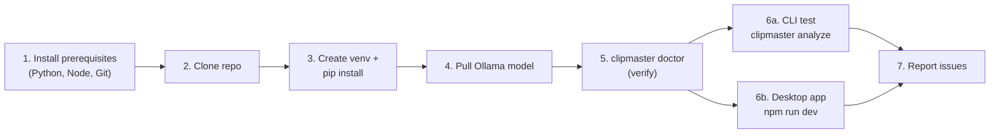

# ClipMaster — Setup & Test Instructions (Target Machine)

Step-by-step guide to install, run, and test ClipMaster on your **execution
machine** (Windows 11 · Radeon **7900 XT** · Ryzen **7800X3D** · 32 GB RAM).

You already have **ffmpeg** and **Ollama** installed. This guide covers the rest,
verification, and how to report problems back for troubleshooting.

> Follow the sections **in order**. Each command block is meant to be pasted into
> **PowerShell**. Lines starting with `#` are comments — you can paste them too.

---

## 0. Quick map of what you'll do



There are **two ways to run** ClipMaster; you can test either or both:
- **CLI** (fastest to verify the pipeline works) — needs only Python.
- **Desktop app** (the full UI) — needs Python **and** Node.js.

---

## 1. Install prerequisites

### 1.1 Python 3.10+ (required)

Install the official CPython — **not** the Microsoft Store version, and **not**
MSYS2/MinGW Python (those can't install the required binary packages).

1. Download from <https://www.python.org/downloads/windows/> (3.11 or 3.12 recommended).
2. In the installer, **tick “Add python.exe to PATH”**, then install.
3. Verify (open a **new** PowerShell window first):

```powershell
python --version
# Expect: Python 3.11.x or 3.12.x
python -c "import sys; print(sys.executable)"
# The path should be under C:\Users\...\Python\ or C:\Program Files\Python...
# It must NOT contain 'MSys2', 'ucrt64', or 'WindowsApps'.
```

### 1.2 Node.js 18+ (required ONLY for the desktop UI)

Skip this if you only want to test via the CLI.

1. Download the **LTS** installer from <https://nodejs.org/> and install (defaults are fine).
2. Verify in a new PowerShell window:

```powershell
node --version   # Expect v18.x or newer
npm --version
```

### 1.3 Git (to pull the code you synced)

If not already installed: <https://git-scm.com/download/win>. Verify:

```powershell
git --version
```

### 1.4 Confirm the tools you already have

```powershell
ffmpeg -version    # should print version info
ffprobe -version   # should print version info
ollama --version   # should print version info
```

If any of these say “not recognized”, they aren't on PATH — reinstall or add them
to PATH before continuing.

---

## 2. Get the code

Clone your GitHub repository (replace the URL with yours):

```powershell
cd C:\   # or wherever you keep projects
git clone https://github.com/<your-username>/clipmaster.git
cd clipmaster
```

> Already cloned? Just `cd` into it and `git pull` to get the latest.

---

## 3. Install ClipMaster (Python)

Create an isolated virtual environment and install the package with the extras
you need.

```powershell
# From the repo root (C:\...\clipmaster)
python -m venv .venv
.\.venv\Scripts\Activate.ps1
```

> **If activation is blocked** with a “running scripts is disabled” error, run
> this once, then re-run the Activate line above:
> ```powershell
> Set-ExecutionPolicy -Scope CurrentUser -ExecutionPolicy RemoteSigned
> ```

Your prompt should now show `(.venv)`. Now install:

```powershell
python -m pip install --upgrade pip

# Full install (pipeline + transcription + server). Recommended.
pip install -e ".[transcribe,server]"
```

This pulls in Whisper (`faster-whisper`), FastAPI/uvicorn, pydantic, etc. First
install downloads a few hundred MB and may take a few minutes.

> **CLI-only, minimal:** if you just want the fastest pipeline check without the
> server, use `pip install -e ".[transcribe]"` instead.

---

## 4. Prepare the local AI (Ollama)

The analysis step uses a **local LLM** via Ollama. Pull the default model named
in `config/default.yaml`:

```powershell
# In a separate PowerShell window (leave it running):
ollama serve

# Back in your main window:
ollama pull llama3.1:8b
```

- `llama3.1:8b` (~4.7 GB) is a good default for your 20 GB-VRAM card.
- The **vision** model (`llava:13b`) is only used by a future milestone — you can
  skip it for now, or `ollama pull llava:13b` if you want it ready.

> **Don't have/want the model?** The pipeline still runs — it falls back to
> heuristic-only analysis and adds a warning. Transcription and silence detection
> work regardless.

---

## 5. Verify the environment

```powershell
clipmaster doctor
```

You want a table with **green “ok”** for:
- `ffmpeg`, `ffprobe` — found on PATH
- `ollama` — model available (`llama3.1:8b`)
- `faster-whisper` — installed

Fix anything red before moving on (see [Troubleshooting](#8-troubleshooting)).

---

## 6. Run a test

### 6a. Test via CLI (quickest)

Use a **short** video first (2–5 min) so the first run is fast.

```powershell
# Inspect the file and see how it will be chunked (no processing):
clipmaster info "C:\path\to\your\video.mp4"

# Fast pass — transcript + silence only, skips the LLM (good first smoke test):
clipmaster analyze "C:\path\to\your\video.mp4" --skip-analysis

# Full analysis (transcription + LLM understanding):
clipmaster analyze "C:\path\to\your\video.mp4"
```

You'll see live stage-by-stage progress. When it finishes, results are written to:

```
workspace\<video-name>-<hash>\
├── analysis.json   # machine-readable result
└── analysis.md     # human-readable report  <-- open this
```

Open the report:

```powershell
# Replace with the folder printed at the end of the run:
notepad "workspace\<video-name>-<hash>\analysis.md"
```

**First-run note:** the very first `analyze` downloads the Whisper model
(`small`) — one-time, a few hundred MB. Later runs are faster.

### 6b. Test the Desktop app (full UI)

Open **two** PowerShell windows.

**Window 1 — keep Ollama running** (if not already a background service):
```powershell
ollama serve
```

**Window 2 — run the app** (it auto-starts the Python backend for you):
```powershell
cd C:\...\clipmaster\desktop
npm install          # first time only (downloads Electron; a few minutes)
npm run dev
```

The ClipMaster window opens (dark UI). Then:
1. Sidebar shows **Environment** badges — all should be green.
2. Click **“Choose file…”**, pick a video → you'll see its info + chunk plan.
3. Click **“Start analysis”** → watch the live **Processing** view.
4. When done, the **Results** view shows summary, timeline, chapters, suggested
   clips, and the transcript. (Clean up / Make shorts / Edit are marked
   *“soon”* — those features come in later milestones.)

> The desktop app needs the Python package installed (Step 3) in a Python that's
> on PATH, because it launches `python -m clipmaster.server` behind the scenes.
> Make sure `python` in Window 2 resolves to the same interpreter — the easiest
> way is to **activate the venv in Window 2 before `npm run dev`**:
> ```powershell
> cd C:\...\clipmaster
> .\.venv\Scripts\Activate.ps1
> cd desktop
> npm run dev
> ```

---

## 7. Optional: run the backend separately (advanced/dev)

Useful if you want to see backend logs directly or iterate on it.

```powershell
# Window A — start the API yourself (activate venv first):
clipmaster serve          # serves http://127.0.0.1:8756

# Window B — tell the desktop app NOT to spawn its own backend:
cd desktop
$env:CLIPMASTER_NO_SIDECAR = "1"
npm run dev
```

Quick manual API check while `clipmaster serve` is running:
```powershell
curl http://127.0.0.1:8756/api/health
```

---

## 8. Troubleshooting

| Symptom | Cause / Fix |
| --- | --- |
| `pip install` fails building `pydantic-core` / “Rust not found” / “Unsupported platform” | You're using MSYS2/MinGW or Store Python. Install official python.org CPython (Step 1.1), recreate the venv, reinstall. |
| `clipmaster` not recognized | The venv isn't active. Run `.\.venv\Scripts\Activate.ps1` from the repo root. |
| `doctor` shows `ffmpeg`/`ffprobe` missing | Not on PATH. Reinstall ffmpeg or add its `bin` folder to PATH, open a **new** window. |
| `doctor` shows `ollama offline` | Start it: `ollama serve`. Check `http://localhost:11434` is reachable. |
| `doctor` shows `ollama model missing` | `ollama pull llama3.1:8b` (or change `llm.model` in `config/local.yaml`). |
| Analysis runs but warns “Ollama unavailable … heuristic analysis only” | LLM step was skipped; transcript/silence still produced. Start Ollama + pull the model, re-run. |
| Transcription very slow | Expected on CPU for large models. Lower the model: set `transcription.model: base` (or `tiny`) in `config/local.yaml`. See [GPU note](#9-amd-gpu-notes). |
| Desktop: “Checking…” never turns green | Backend didn't start. Ensure the venv Python is on PATH in the same window (activate venv before `npm run dev`), or run the backend separately (Step 7). |
| `npm run dev` fails | Ensure Node 18+ (`node --version`). Delete `desktop\node_modules` and re-run `npm install`. |
| Activation blocked (“scripts is disabled”) | `Set-ExecutionPolicy -Scope CurrentUser -ExecutionPolicy RemoteSigned`, then activate again. |

### Tune settings without editing defaults
Create **`config\local.yaml`** (git-ignored) with only the keys you want to
override, e.g.:
```yaml
transcription:
  model: base        # faster than 'small' on CPU
llm:
  model: llama3.1:8b
```

---

## 9. AMD GPU notes (7900 XT / Windows)

Your card has **no CUDA**, so:
- **Ollama (LLM):** uses the 7900 XT automatically on recent Windows builds.
  Verify while a model is loaded: `ollama ps` (should show GPU).
- **Whisper (transcription):** `faster-whisper` is **CPU-only on AMD** — it runs
  on your 7800X3D (fine for `tiny`/`base`/`small`). GPU-accelerated transcription
  on AMD (whisper.cpp + Vulkan) is a planned drop-in; not required to test now.
- **Recommended default today:** CPU Whisper (`small` or `base`) + GPU Ollama.

---

## 10. How to report a problem (for troubleshooting)

When something fails, copy back **all** of the following into the chat:

1. The **exact command** you ran.
2. The **full terminal output** (not a screenshot — copy the text).
3. Output of:
   ```powershell
   python --version
   clipmaster doctor
   ```
4. For desktop issues, also the output from **both** the `npm run dev` window and
   any `[backend]` lines it printed.

With that, the error can be diagnosed and fixed quickly.

---

## Command cheat-sheet

```powershell
# One-time setup
python -m venv .venv
.\.venv\Scripts\Activate.ps1
pip install -e ".[transcribe,server]"
ollama pull llama3.1:8b

# Every session: activate first
.\.venv\Scripts\Activate.ps1

# Verify
clipmaster doctor

# CLI
clipmaster info    "C:\video.mp4"
clipmaster analyze "C:\video.mp4" --skip-analysis
clipmaster analyze "C:\video.mp4"

# Desktop app
cd desktop; npm install; npm run dev
```
