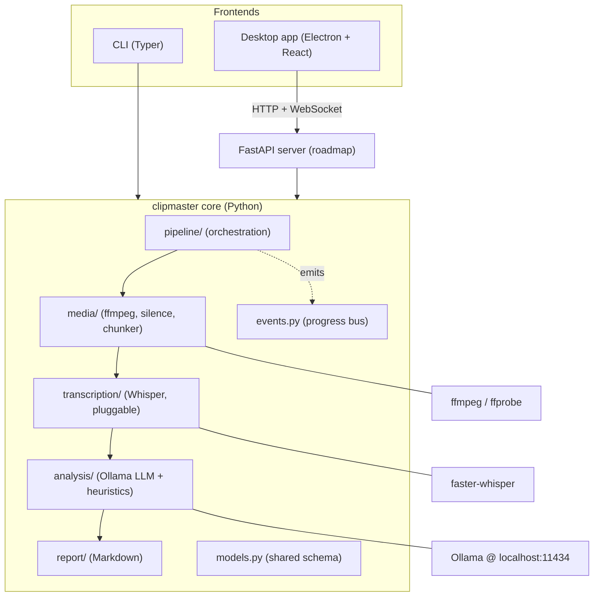
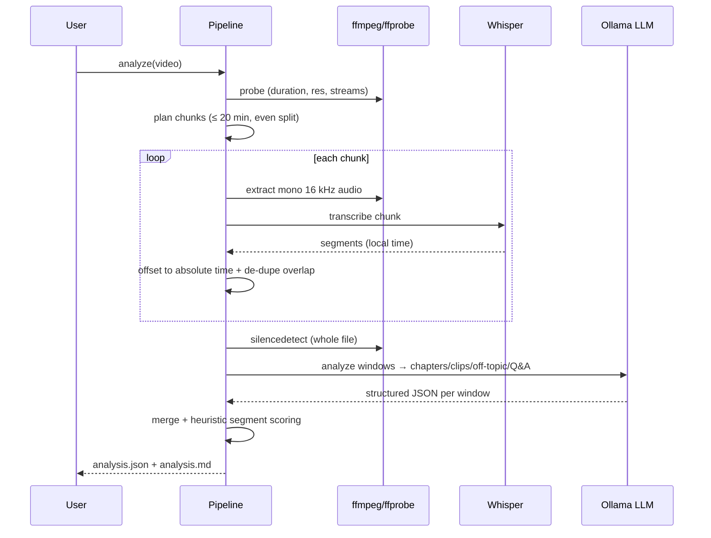
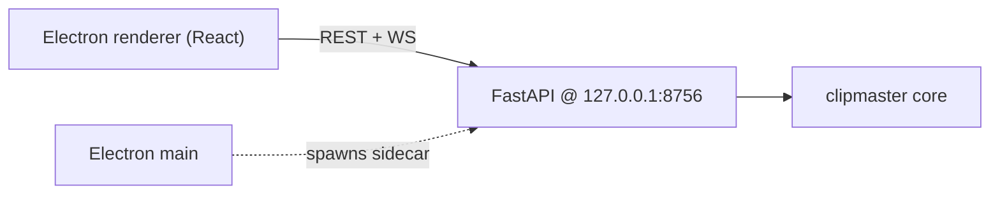

# ClipMaster

**Local-first video analysis & editing pipeline.** Feed it a work/educational
video and ClipMaster transcribes it, understands it, and then lets you *act* on
it: produce a clean cut, generate topic-focused shorts, or edit in intros/outros
and text overlays from reusable templates — all through a professional,
minimal, dark desktop editor (with a full CLI for development).

Everything runs **on your machine**: local Whisper for speech-to-text and a
local **Ollama** LLM for understanding. No cloud, no per-minute costs, your
footage never leaves the box.

> **Status:** Milestones 1–3 are implemented — the analysis pipeline (ingest,
> chunking, transcription, silence detection, LLM analysis, report), the HTTP +
> WebSocket **API server**, and the **Electron desktop editor shell** (dark,
> minimal UI with live status and per-phase action prompts). Cleanup, shorts and
> editing are on the [roadmap](#roadmap) and build directly on the analysis
> artifact.

---

## Table of contents

- [Why the analysis comes first](#why-the-analysis-comes-first)
- [Architecture](#architecture)
- [The processing flow](#the-processing-flow)
- [Project layout](#project-layout)
- [The analysis artifact (`analysis.json`)](#the-analysis-artifact-analysisjson)
- [Configuration reference](#configuration-reference)
- [Setup on the target machine (Windows 11 · 7900 XT)](#setup-on-the-target-machine-windows-11--7900-xt)
- [AMD GPU acceleration](#amd-gpu-acceleration)
- [Privacy & network use](#privacy--network-use)
- [Usage (CLI)](#usage-cli)
- [Desktop app & API server](#desktop-app--api-server)
- [Development on the code-generation machine](#development-on-the-code-generation-machine)
- [Roadmap](#roadmap)

---

## Why the analysis comes first

Every downstream feature is a *decision over time ranges*:

| Feature            | What it needs from analysis                                  |
| ------------------ | ------------------------------------------------------------ |
| **Cleanup**        | Which spans are silence / filler / off-topic → what to keep  |
| **Shorts**         | Self-contained, high-value spans ≤ N seconds → clip candidates|
| **Editing**        | Chapter boundaries & topics → where intros/overlays belong   |
| **Summary report** | Chapters, keywords, summary                                  |

So the pipeline's job is to turn a raw video into **one rich, structured
artifact** (`analysis.json`) that all the tools consume. Get the analysis right
and everything else becomes a transformation of that artifact.

---

## Architecture

ClipMaster is layered so the **CLI**, the **HTTP server** and the **desktop UI**
all share one core. The core never imports UI code; it publishes progress to an
event bus that each front-end renders in its own way.



**Layer responsibilities**

- **`config.py`** — layered YAML config → a validated `Settings` object.
- **`events.py`** — a tiny pub/sub `EventBus`; the pipeline emits `ProgressEvent`s
  (`stage_start`, `progress`, `stage_end`, …) so the UI can show *what is
  happening right now* and *what to do next*.
- **`models.py`** — the shared, serialisable vocabulary (`MediaInfo`,
  `Transcript`, `Chapter`, `ClipCandidate`, `AnalysisReport`, …).
- **`media/`** — thin, well-behaved wrappers over `ffmpeg`/`ffprobe`: probing,
  audio extraction, `silencedetect`, and evenly balanced chunk planning.
- **`transcription/`** — a `Transcriber` interface with a `faster-whisper`
  implementation. New backends (e.g. whisper.cpp/Vulkan for AMD) drop in behind
  the same interface.
- **`analysis/`** — a small Ollama HTTP client plus a `TranscriptAnalyzer` that
  fuses deterministic heuristics with LLM understanding, degrading gracefully to
  heuristics-only if Ollama is offline.
- **`pipeline/`** — composes the layers into the end-to-end analysis workflow.
- **`report/`** — renders the artifact into readable Markdown.

---

## The processing flow



### Chunking logic (the ≤ 20-minute rule)

A single processing unit never exceeds `chunking.max_chunk_seconds` (default
**20 min**). Longer videos are divided into `N = ceil(duration / max)`
**evenly sized** chunks so the workload is balanced and memory stays bounded:

| Video length | Chunks | Each chunk |
| -----------: | :----: | :--------- |
| 12 min       | 1      | 12:00      |
| 30 min       | 2      | 15:00      |
| 40 min       | 2      | 20:00      |
| 50 min       | 3      | ~16:40     |

A small `overlap_seconds` is appended to each non-final chunk so a sentence
straddling a boundary is transcribed intact; overlapping segments are
de-duplicated when the transcript is merged back onto the absolute timeline.

---

## Project layout

```
clipmaster/
├── config/
│   └── default.yaml          # all tunable parameters (documented inline)
├── clipmaster/               # the core Python package
│   ├── config.py             # layered config → typed Settings
│   ├── events.py             # progress/event bus for live UI + CLI
│   ├── logging_setup.py      # Rich-based logging
│   ├── models.py             # pydantic data models (shared schema)
│   ├── cli.py                # Typer CLI (doctor / info / analyze / report)
│   ├── media/
│   │   ├── ffmpeg.py         # ffmpeg/ffprobe subprocess wrappers
│   │   ├── probe.py          # file → MediaInfo
│   │   ├── silence.py        # audio extraction + silencedetect
│   │   └── chunker.py        # even chunk planning + extraction
│   ├── transcription/
│   │   ├── base.py           # Transcriber interface + factory
│   │   └── faster_whisper_provider.py
│   ├── analysis/
│   │   ├── ollama_client.py  # local Ollama HTTP client (JSON mode)
│   │   └── transcript_analyzer.py  # heuristics + LLM understanding
│   ├── pipeline/
│   │   └── analyze.py        # ingest → transcribe → analyze → report
│   ├── report/
│   │   └── builder.py        # AnalysisReport → Markdown
│   └── server/               # M2: HTTP + WebSocket API for the desktop app
│       ├── app.py            # FastAPI routes + job WebSocket stream
│       ├── jobs.py           # background jobs (thread → asyncio bridge)
│       └── schemas.py        # request/response models
├── desktop/                  # M3: Electron + React + TS dark editor
│   ├── electron.vite.config.ts
│   ├── package.json
│   └── src/
│       ├── main/index.ts     # window + Python sidecar + native file dialog
│       ├── preload/index.ts  # safe contextBridge API
│       └── renderer/src/      # React app (Home / Processing / Results views)
├── tests/                    # pure-logic unit tests (no GPU/model needed)
├── pyproject.toml            # packaging, deps, extras, `clipmaster` entrypoint
└── README.md
```

At runtime each video becomes a **project folder** under `workspace/`:

```
workspace/<slug>-<hash8>/
├── audio/chunk_000.wav …     # extracted per-chunk audio
├── analysis.json             # the machine-readable artifact (source of truth)
└── analysis.md               # human-readable report
```

---

## The analysis artifact (`analysis.json`)

The `AnalysisReport` model (see [`clipmaster/models.py`](clipmaster/models.py))
is the contract between analysis and every action. Key fields:

| Field                 | Meaning                                                        |
| --------------------- | -------------------------------------------------------------- |
| `media`               | duration, resolution, fps, codecs, audio streams               |
| `chunk_plan`          | how the video was split for processing                         |
| `transcript`          | language + timestamped `segments` (with word timings)          |
| `silences`            | detected silent spans (`start`/`end`)                          |
| `summary`, `keywords` | whole-video overview                                           |
| `chapters`            | coherent topical sections (`title`, `start`, `end`, `summary`) |
| `segment_analyses`    | per-segment verdict: `kind`, `importance`, `keep`, `reason`    |
| `clip_candidates`     | standalone highlights with `score` and a one-line `hook`       |
| `cleanup_keep_spans`  | the spans a clean cut would retain (the cleanup EDL)           |
| `warnings`            | e.g. "Ollama unavailable; heuristic analysis only"             |

`segment_analyses[*].kind` is one of `on_topic`, `off_topic`, `qa`, `filler`,
`intro`, `outro`, `transition`. `importance` is `0..1`; a segment is marked to
keep when `importance >= analysis.keep_importance_threshold` and it isn't filler
or off-topic.

---

## Configuration reference

All parameters live in [`config/default.yaml`](config/default.yaml). Override
them without editing that file by creating **`config/local.yaml`** (git-ignored),
passing **`--config path.yaml`**, or setting `CLIPMASTER_*` env vars.

| Section         | Key                        | Default            | Purpose                                             |
| --------------- | -------------------------- | ------------------ | --------------------------------------------------- |
| `chunking`      | `max_chunk_seconds`        | `1200` (20 min)    | Hard ceiling per processing unit                    |
|                 | `overlap_seconds`          | `2.0`              | Overlap so boundary sentences aren't cut            |
| `silence`       | `noise_db`                 | `-30.0`            | Level below which audio counts as silent            |
|                 | `min_silence_seconds`      | `0.6`              | Shortest silence worth reporting                    |
| `transcription` | `model`                    | `small`            | Whisper size (`tiny`…`large-v3`)                    |
|                 | `device` / `compute_type`  | `cpu` / `int8`     | Where/how Whisper runs                              |
|                 | `language`                 | `null` (auto)      | Force a language, or auto-detect                    |
| `llm`           | `host`                     | `localhost:11434`  | Ollama endpoint                                     |
|                 | `model`                    | `llama3.1:8b`      | Chat model for analysis                             |
|                 | `vision_model`             | `llava:13b`        | Keyframe understanding (roadmap)                    |
|                 | `max_input_chars`          | `12000`            | Transcript window size per LLM call                 |
| `analysis`      | `filler_words`             | list               | Words that lower a segment's importance             |
|                 | `keep_importance_threshold`| `0.35`             | Keep/cut cutoff for cleanup                         |
| `clips`         | `max_duration_seconds`     | `30`               | Soft max length of a generated short                |
|                 | `target_count`             | `6`                | How many shorts to produce                          |

Environment overrides: `CLIPMASTER_WORKSPACE`, `CLIPMASTER_OLLAMA_HOST`,
`CLIPMASTER_LLM_MODEL`, `CLIPMASTER_WHISPER_MODEL`, `CLIPMASTER_WHISPER_DEVICE`,
`CLIPMASTER_LOG_LEVEL`.

---

## Setup on the target machine (Windows 11 · 7900 XT)

You already have **ffmpeg** and **Ollama** installed. Full checklist:

### 1. Python 3.10+
Install the official CPython from [python.org](https://www.python.org/downloads/)
(not the Microsoft Store build). Then, from the repo root:

```powershell
python -m venv .venv
.\.venv\Scripts\Activate.ps1
python -m pip install --upgrade pip
pip install -e ".[transcribe,server,dev]"
```

### 2. ffmpeg / ffprobe
Confirm they're on `PATH`:

```powershell
ffmpeg -version ; ffprobe -version
```

### 3. Ollama models
Pull the models named in your config (adjust as you like):

```powershell
ollama pull llama3.1:8b      # analysis LLM
ollama pull llava:13b        # vision model (used in a later milestone)
ollama serve                 # if it isn't already running as a service
```

### 4. Verify everything

```powershell
clipmaster doctor
```

You should see green checks for ffmpeg, ffprobe, Ollama (with the model
available) and faster-whisper.

> **Software you must have on the target machine:** Python 3.10+, ffmpeg (✓),
> Ollama (✓) + the pulled models. Everything else installs via `pip`.

---

## AMD GPU acceleration

Your **7900 XT** is an RDNA3 card, so there is **no CUDA**. Here's how each piece
uses the GPU on **Windows 11**:

- **Ollama (LLM):** recent Ollama builds accelerate RDNA3 on Windows via ROCm/HIP
  automatically. Verify with `ollama ps` while a model is loaded — it should show
  GPU usage. No code changes needed.
- **Whisper (speech-to-text):** `faster-whisper` uses CTranslate2, which supports
  **CPU and NVIDIA CUDA only** — *not* AMD. On this machine it runs on the
  **7800X3D CPU** (great for `tiny`/`base`/`small`). For **GPU-accelerated**
  transcription on AMD, the recommended path is **whisper.cpp with the Vulkan
  backend**, which runs well on RDNA3 under Windows. It slots in behind the
  existing `Transcriber` interface — a `whisper_cpp` provider is a planned
  drop-in (see [`clipmaster/transcription/base.py`](clipmaster/transcription/base.py)).
- **ffmpeg:** encoding/decoding can use AMD's **AMF** hardware encoder
  (`h264_amf` / `hevc_amf`) during rendering in later milestones.

Practical default today: **CPU Whisper (`small`, `int8`) + GPU Ollama.** That
keeps setup simple and still uses the GPU for the heavy LLM work.

---

## Privacy & network use

ClipMaster is **local-first**: your video, audio, transcript and analysis never
leave the machine. All processing (ffmpeg, Whisper transcription, Ollama LLM) runs
on your own hardware.

The **only** outbound network access is a **one-time model download**:

- The first time you transcribe, `faster-whisper` downloads the Whisper weights
  (e.g. `Systran/faster-whisper-small`) from Hugging Face **into** the local cache
  at `~/.cache/huggingface`. This is a download, not an upload of your data.
- After that, transcription works **fully offline** from cache.

On that first download you may see two harmless warnings:

| Warning | Meaning | Action |
| --- | --- | --- |
| *"unauthenticated requests to the HF Hub… set a HF_TOKEN"* | Model downloaded anonymously (a rate-limit notice, not an error). | None — anonymous is fine. |
| *"symlinks… your machine does not support them"* | Windows without Developer Mode caches model files as copies instead of symlinks (uses a little more disk). | None, or enable Windows Developer Mode. |

To keep things quiet and telemetry-free, ClipMaster sets
`HF_HUB_DISABLE_TELEMETRY=1` and `HF_HUB_DISABLE_SYMLINKS_WARNING=1` by default
before loading the model (you can override them). For a **strictly offline**
machine, pre-download the model once, then set `HF_HUB_OFFLINE=1` to forbid all
network access.

---

## Usage (CLI)

```powershell
# Environment / dependency check
clipmaster doctor

# Inspect a file and see how it will be chunked
clipmaster info "C:\videos\lecture.mp4"

# Full analysis → workspace/<project>/analysis.json + analysis.md
clipmaster analyze "C:\videos\lecture.mp4"

# Fast pass: transcript + silence only, skip the LLM step
clipmaster analyze "C:\videos\lecture.mp4" --skip-analysis

# Re-render the Markdown report from an existing analysis
clipmaster report <project_id>
```

The `analyze` command streams live stage-by-stage progress — the same events the
desktop editor will render as its status panel.

---

## Desktop app & API server

The desktop editor (`desktop/`) is an **Electron + React + TypeScript** app with a
dark, minimal UI. It never touches ffmpeg or models directly — it drives the
same core through the **API server** (`clipmaster/server/`), which streams live
pipeline progress over a WebSocket.



### One-command dev run

From `desktop/`, the app spawns the Python API as a **sidecar** automatically:

```powershell
# 1) install the Python package with the server extra (once)
pip install -e ".[transcribe,server]"

# 2) run the desktop app (spawns `python -m clipmaster.server` for you)
cd desktop
npm install
npm run dev
```

### Run the server separately (optional)

Handy when iterating on the backend. Start the API yourself and tell the desktop
app not to spawn its own:

```powershell
clipmaster serve                     # http://127.0.0.1:8756
# in another terminal:
cd desktop
$env:CLIPMASTER_NO_SIDECAR = "1"     # don't spawn a second server
npm run dev
```

Useful environment variables for the desktop app:

| Variable                  | Purpose                                        |
| ------------------------- | ---------------------------------------------- |
| `CLIPMASTER_NO_SIDECAR=1` | Don't spawn the Python server (use a running one) |
| `CLIPMASTER_PYTHON`       | Python executable used for the sidecar         |
| `CLIPMASTER_SERVER_HOST`  | API bind host (default `127.0.0.1`)            |
| `CLIPMASTER_SERVER_PORT`  | API port (default `8756`)                      |
| `CLIPMASTER_LOG_FILE`     | Path (file or folder) for a persistent log file |

### Settings

The app ships with a **Settings** panel (gear icon at the bottom of the left
sidebar) so it can run standalone — no terminal needed to get dependencies
working:

- **Dependencies** — live status for ffmpeg, ffprobe and faster-whisper. Missing
  items show a copy-paste `winget` command and a link to the official download
  page (nothing is installed silently).
- **Ollama** — shows whether the local server is reachable and on which port, a
  **Start Ollama** button if it's down, the list of installed models with a
  one-click **Use** to pick the active model, and a **Pull** box with live
  download progress.
- **Logs & issues** — choose a folder where a rotating log file is written, open
  that folder, and watch a live tail of recent log lines (errors highlighted).

Model and log-path choices are remembered in `config/local.yaml`.

### API surface

| Method | Path                          | Purpose                                  |
| ------ | ----------------------------- | ---------------------------------------- |
| GET    | `/api/health`                 | ffmpeg / Ollama / whisper status         |
| POST   | `/api/probe`                  | quick media info + chunk plan            |
| POST   | `/api/analyze`                | start an analysis job → `{job_id}`       |
| GET    | `/api/jobs/{id}`              | job status snapshot                      |
| WS     | `/ws/jobs/{id}`               | live progress event stream               |
| GET    | `/api/projects`               | list analysed projects                   |
| GET    | `/api/projects/{id}`          | full `analysis.json`                     |
| GET    | `/api/projects/{id}/report`   | Markdown report                          |
| GET    | `/api/diagnostics`            | dependency + Ollama + log status         |
| POST   | `/api/ollama/start`           | start `ollama serve` if not running      |
| POST   | `/api/settings/model`         | set the active LLM model                 |
| POST   | `/api/ollama/pull`            | pull a model → `{pull_id}`               |
| GET    | `/api/ollama/pull/{id}`       | model pull progress                      |
| GET    | `/api/logs`                   | recent log lines + active log path       |
| POST   | `/api/logs/path`              | set the log file/folder                  |

> **Node.js 18+** is required to build/run the desktop app (`npm`). It is only
> needed on the machine that runs the UI, not for the Python core or CLI.

---

## Development on the code-generation machine

This repo is authored on a separate Windows box and synced to GitHub; it runs for
real on the 7900 XT machine. On a standard CPython install the whole suite works:

```powershell
pip install -e ".[dev]"
pytest
```

The unit tests (chunk planning, config merging, model round-trips, analysis
heuristics, response parsing, report rendering) need **no GPU, ffmpeg or Ollama**
— they validate the deterministic logic in isolation.

> If your dev Python is an MSys2/MinGW build, PyPI binary wheels (e.g.
> `pydantic-core`) won't install; use a standard python.org CPython instead.

---

## Roadmap

Built incrementally; each milestone consumes the analysis artifact.

- [x] **M1 — Analysis foundation:** ingest, even chunking, local transcription,
  silence detection, LLM + heuristic analysis, JSON/Markdown report, CLI.
- [x] **M2 — HTTP server:** FastAPI + WebSocket streaming of the event bus, so
  the desktop app can drive the pipeline and show live status.
- [x] **M3 — Desktop editor shell (Electron + React):** dark, minimal UI —
  Home (select + probe), Processing (live stage/log), Results (summary,
  timeline, chapters, clips, transcript) with per-phase action prompts
  ("Summarise / Clean up / Make shorts / Edit"). Includes a **Settings** panel
  to detect/guide dependency setup, start Ollama, pick/pull models, and
  configure a log file.
- [ ] **M4 — Cleanup renderer:** turn `cleanup_keep_spans` into a trimmed video
  (remove silence / filler / off-topic), with a review-before-render step.
- [ ] **M5 — Shorts generator:** render `clip_candidates` to ≤ N-second shorts,
  with reframing and burned-in captions.
- [ ] **M6 — Editing & templates:** intro/outro banners from files, described
  text overlays, and reusable templates that remember placement.
- [ ] **M7 — Visual analysis:** keyframe extraction + local vision model for
  slide/scene understanding to enrich chapters and clip selection.

---

## License

MIT — see `pyproject.toml`.
